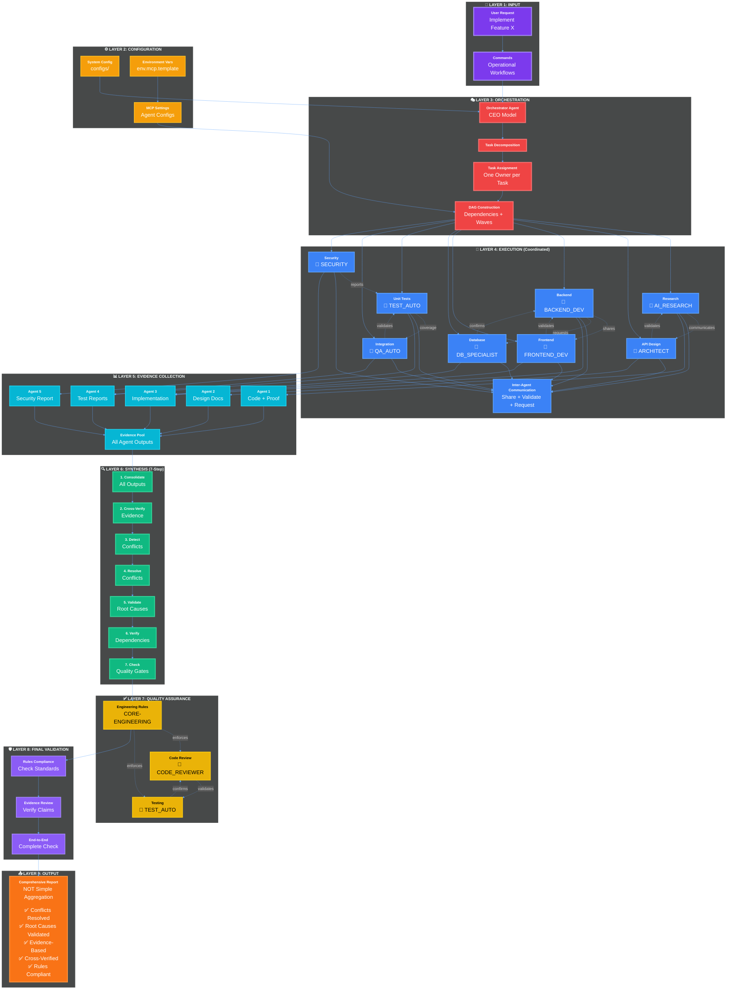

# AI Dev Toolkit

AI agents, commands, and skills for software development.

---

## System Architecture: 9-Layer Coordinated Multi-Agent Orchestrator



---

## Architecture Breakdown

**9-Layer Flow:**

1. **INPUT** → User request + commands
2. **CONFIGURATION** → System config (MCP, env, settings)
3. **ORCHESTRATION** → Task decomposition → assignment (one owner per task) → DAG construction
4. **EXECUTION** → 8 tasks in 3 waves, agents communicate (not independent)
5. **EVIDENCE** → All agents provide proof (code, tests, logs, metrics)
6. **SYNTHESIS** → 7-step process (consolidate → cross-verify → detect conflicts → resolve → validate root causes → verify dependencies → quality gates)
7. **QUALITY** → Rules enforcement + code review + testing validation
8. **VALIDATION** → 3-step final check (compliance → evidence review → end-to-end)
9. **OUTPUT** → Comprehensive report (NOT aggregation, includes conflict resolution)

**Coordination Patterns:**
- Task ownership: Each task = 1 dedicated agent (e.g., T1 → AI_RESEARCH)
- Inter-agent communication: Dotted lines show context sharing, validation, requests
- Evidence required: All agents must provide proof/validation
- Synthesis: NOT simple aggregation, 7-step comprehensive analysis
- Validation: Multi-layer checks before final output

**Scales by complexity:**
- Simple (1-5 min): 1 agent, direct path
- Medium (5-15 min): 5-10 agents, 2 waves, synthesis
- Complex (15-60 min): 20-30 agents, 3+ waves, full 9-layer flow

---

## Repository Structure

```
ai-dev-toolkit/
├── agents/     49 specialized agents
├── commands/   28 operational commands
├── skills/     17 domain modules
├── configs/    MCP, env, settings
└── rules/      Engineering standards
```

---

## Agents (49 total)

**Development (8):** code-assistant, code-reviewer, test-automation, go-linter, docker-builder, backend-dev, frontend-dev, refactoring
**Infrastructure (10):** k8s-troubleshooter, storage-debugger, devops, iac, cloud-architect, network, sre, monitoring, capacity-planner, cost-optimizer
**Security (6):** security-auditor, security-tester, secrets-manager, compliance-auditor, compliance-validator, chaos-engineer
**Docs/Research (5):** doc-generator, doc-writer, ai-research, research-assistant, code-explainer
**Specialized (20):** linkedin, prompt-engineer, git-identity, ml-trainer, database, api-designer, microservices, openshift, azure, filesystem, snapshot, manifest-validator, integration-tester, load-tester, qa-automation, rag-specialist, unified-doc, incident-responder, release-manager, performance-optimizer

---

## Commands (28 total)

**Core:** fix, review, test, deploy-driver, build-docker-images
**Dev:** code-review, generate-code-ai, format-go-code, run-all-tests, validate-k8s-manifests
**Docs:** generate-docs, document-fix, live-doc, explain-code
**Infra:** remote-server-ops, k8s-integration, benchmark-performance, system-diag
**Orchestration:** multi-agent-orchestrate, agent-coordinate, dag-visualize, create-agent
**Research/AI:** ai-research, read-cv, mcp-connect

---

## Skills (17 total)

**Storage:** storage-driver-development, storage-troubleshooting, distributed-filesystem, filesystem-performance-tuning
**Kubernetes:** kubernetes-storage, kubernetes-operator-patterns, openshift-deployment, container-security
**Development:** go-best-practices, grpc-development, docker-optimization, ci-cd-pipelines
**AI:** ai-assisted-development, llm-integration, prompt-engineering, research-methodology
**Other:** big-data-connector

---

## Configuration

```bash
# Setup
cp configs/env.mcp.template ~/.ai-config/env.mcp
# Edit with API keys
nano ~/.ai-config/env.mcp
# Source
echo 'source ~/.ai-config/env.mcp' >> ~/.zshrc
source ~/.ai-config/env.mcp
```

**MCP configs:** mcp-config-active.json, mcp-config-50-servers.json, mcp-config-enhanced.json
**Terminal:** starship.toml, tmux.conf, zshrc-enhanced, zshrc-remote

---

## Engineering Rules

**CORE-ENGINEERING-RULES.md:** Coding standards (50-line functions, 80%+ coverage), security (no hardcoded secrets), testing, Git workflow
**SPECIALIZED-SYSTEMS.md:** Multi-agent orchestration (46+ agents), token optimization (65-75% reduction), system optimization

---

## Quick Start

```bash
# Setup
git clone <repo-url> ai-dev-toolkit
cd ai-dev-toolkit
cp configs/env.mcp.template ~/.ai-config/env.mcp
# Edit with API keys

# Usage
/review path/to/code
/generate-docs path/to/project
/deploy-driver --namespace storage-driver
/multi-agent-orchestrate --task "Implement feature X"
```

**Placeholders to replace:** `<AUTHOR_NAME>`, `<PERSONAL_EMAIL>`, `<WORK_EMAIL>`, `<GITHUB_HANDLE>`, `<USER_HOME>`

---

## Security

**Credentials:** All use environment variables. Zero hardcoded secrets. Templates use placeholders only.
**Audit:** 14-point security scan passed. Zero credentials found. Production-ready.

---

## Statistics

49 agents, 28 commands, 17 skills, 2 rule files, 100+ total files

---

## Contributing

Follow `rules/CORE-ENGINEERING-RULES.md`: functions <50 lines, @author tags, 80%+ coverage, zero lint errors, no hardcoded secrets

---

## License

Configuration templates and documentation. Customize for your use.

---

## Support

Check `/agents/`, `/commands/`, `/skills/`, or `/rules/` for guidance

---

**Status:** Production-ready | **Updated:** 2026-07-11
