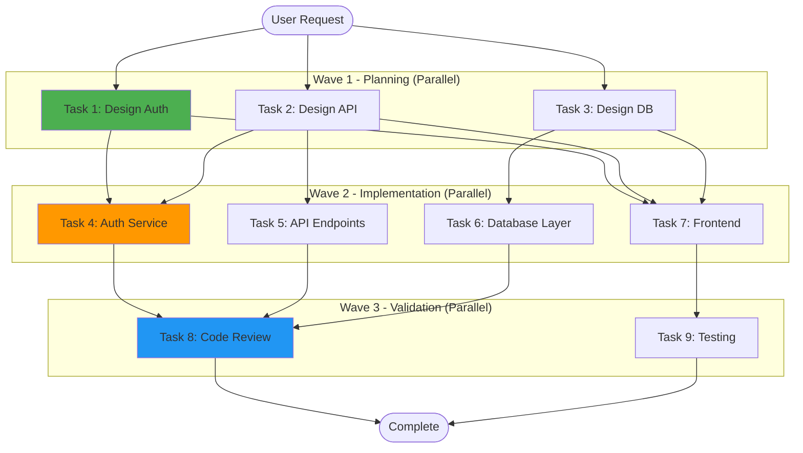

# DAG Visualization Command

**Author**: <AUTHOR_NAME>  
**Date**: 2026-07-03

Visualize task dependency graphs with wave-based execution analysis and critical path identification.

## Usage

```bash
# Visualize current task DAG
/dag

# Visualize with metrics
/dag --metrics

# Show critical path
/dag --critical-path

# Export to Mermaid
/dag --format=mermaid
```

## DAG Construction Algorithm

### Step 1: Task Decomposition

```
Complex Task
    ↓
[Identify Atomic Subtasks]
    - Each subtask: 1-2 files, 10-50 lines
    - Clear input/output contract
    - Single responsibility
    ↓
[Map Dependencies]
    - Task A requires output of Task B
    - Build dependency edges
    ↓
[Detect Cycles]
    - Run topological sort (Kahn's algorithm)
    - Fail if cycles detected
```

### Step 2: Wave Computation

```python
def compute_waves(dag):
    """
    Compute execution waves via topological sort.
    Wave N contains all tasks with no dependencies on wave N+1.
    """
    waves = []
    in_degree = {task: len(task.dependencies) for task in dag.tasks}
    
    while in_degree:
        # Current wave: all tasks with in_degree == 0
        wave = [task for task, degree in in_degree.items() if degree == 0]
        waves.append(wave)
        
        # Remove completed tasks
        for task in wave:
            del in_degree[task]
            for dependent in task.dependents:
                in_degree[dependent] -= 1
    
    return waves
```

### Step 3: Critical Path Analysis

```
Critical Path = Longest dependency chain from start to end

Example:
Task1 (20min) → Task4 (30min) → Task7 (15min) = 65min (critical path)
Task2 (10min) → Task5 (10min)                 = 20min
Task3 (15min) → Task6 (20min)                 = 35min

Minimum completion time = 65 minutes (critical path length)
Parallelism potential = Total work / Critical path = 110 / 65 = 1.69×
```

## Mermaid Output



## Metrics Display

```yaml
dag_analysis:
  total_tasks: 9
  total_waves: 3
  critical_path:
    - Task 1 → Task 4 → Task 8 (65 min)
  parallelism:
    wave_1: 3 tasks (20 min)
    wave_2: 4 tasks (30 min)
    wave_3: 2 tasks (15 min)
  speedup:
    sequential: 135 min
    parallel: 65 min
    ratio: 2.08×
  wave_utilization:
    wave_1: 100% (3/3 agents busy)
    wave_2: 100% (4/4 agents busy)
    wave_3: 100% (2/2 agents busy)
  file_ownership:
    conflicts: 0
    disjoint: true
```

## Validation Checks

### ✅ DAG Validity

- No cycles detected
- All tasks reachable from start
- All tasks lead to end
- Dependency completeness

### ✅ Parallelism Potential

- Wave count (optimal: 3-5)
- Tasks per wave (balanced: 2-5)
- Critical path ratio (<50% of total work)

### ✅ Resource Allocation

- Agent count matches max wave size
- No file ownership conflicts
- Estimated time within budget

## Reference Files

- `.ai-config/scripts/dag-executor.py`
- `.ai-config/skills/dag-planning/`
