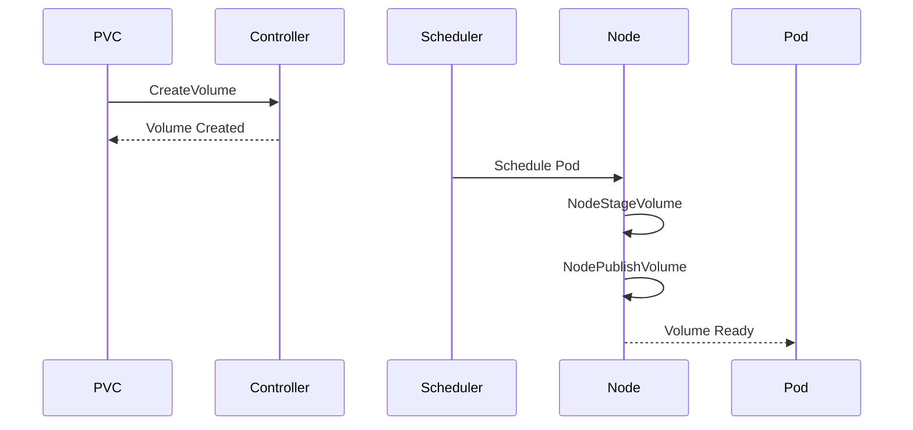

# Explain Code Command

**Author**: <AUTHOR_NAME>  
**Date**: 2026-04-07

Get detailed, multi-level explanations of complex code, architecture patterns, and design decisions.

## Usage

```bash
# Explain specific function
/explain <file-path>:<function-name>

# Explain entire file
/explain <file-path>

# Explain architecture component
/explain arch:<component-name>

# Explain code snippet
/explain --snippet="<code>"
```

## Explanation Levels

### Level 1: Quick Summary (30 seconds)
```bash
/explain pkg/driver/controller.go:CreateVolume --level=quick
```

**Output**:
> **CreateVolume** provisions a new persistent volume on distributed filesystem.
> Takes PVC name and capacity, creates directory, sets quota, returns volume metadata.
> Key for Kubernetes dynamic provisioning workflow.

### Level 2: Component Breakdown (2-3 minutes)
```bash
/explain pkg/driver/controller.go:CreateVolume --level=standard
```

**Output**:
```markdown
# Function: CreateVolume

## Purpose
Creates new Storage Interface volume by provisioning storage on distributed filesystem.

## Components
1. **Validation** (lines 48-52): Checks request parameters
2. **Idempotency** (lines 54-58): Returns existing volume if found
3. **Provisioning** (lines 60-75): Creates directory and sets quota
4. **Response** (lines 77-82): Returns volume metadata

## Flow
Request → Validate → Check Exists → Provision → Return
```

### Level 3: Deep Dive (5-10 minutes)
```bash
/explain pkg/driver/controller.go:CreateVolume --level=deep
```

**Output**: Comprehensive explanation with:
- Line-by-line walkthrough
- Design pattern analysis
- Trade-off discussions
- Alternative approaches
- Common pitfalls
- Related functions

## Examples

### Explain Function
```bash
/explain pkg/driver/node.go:NodePublishVolume
```

**Output**:
```markdown
# Function: NodePublishVolume

**File**: pkg/driver/node.go  
**Lines**: 145-198  
**Author**: <AUTHOR_NAME>

## Purpose
Bind-mounts the staged volume to the pod's target path, making storage
accessible to the container.

## Storage Interface Spec Context
NodePublishVolume is the final step in Storage Interface volume lifecycle:
1. Controller creates volume → Storage provisioned
2. Node stages volume → Filesystem mounted to staging path
3. **Node publishes volume** → Bind mount to pod path ← WE ARE HERE

## Parameters Explained
- `volume_id`: Unique identifier from CreateVolume
- `staging_target_path`: Where NodeStageVolume mounted the filesystem
- `target_path`: Pod-specific path (e.g., /var/lib/kubelet/pods/.../volumes/)

## Why Bind Mount?
**Problem**: Multiple pods need same Distributed Filesystem volume.
**Solution**: Mount once (NodeStage), bind mount many times (NodePublish).
**Benefit**: Efficient resource usage, single Distributed Filesystem mount point.

## Line-by-Line
**Lines 150-155**: Parameter validation
```go
if req.VolumeId == "" {
    return nil, status.Error(codes.InvalidArgument, "volume ID required")
}
```
> Validates required Storage Interface spec fields. Returns gRPC InvalidArgument per spec.

**Lines 157-162**: Check if already published (idempotency)
```go
mounted, err := d.isMounted(targetPath)
if mounted {
    return &csi.NodePublishVolumeResponse{}, nil
}
```
> Storage Interface operations must be idempotent. Re-publishing is a no-op.

**Lines 164-175**: Create target directory and bind mount
> Creates pod-specific mount point, then bind mounts from staging path.
> Uses MS_BIND flag for bind mount (not a new filesystem mount).

## Common Issues
1. **Permission denied**: Target path not writable by kubelet
2. **Device busy**: Previous mount not cleaned up
3. **Invalid argument**: Staging path not mounted

## Related Functions
- `NodeStageVolume`: Mounts distributed filesystem
- `NodeUnpublishVolume`: Cleanup counterpart
- `isMounted`: Helper for idempotency checks
```

### Explain Architecture
```bash
/explain arch:csi-volume-lifecycle
```

**Output**:
```markdown
# Architecture: Storage Interface Volume Lifecycle

## Overview
Storage Interface volume lifecycle spans controller and node components through 6 phases.

## Phase Diagram


## Detailed Phases

### Phase 1: Volume Creation (Controller)
**Trigger**: PVC created in Kubernetes
**Action**: Controller.CreateVolume()
**Result**: Storage provisioned on Distributed Filesystem

### Phase 2: Volume Attachment (Controller)
**Trigger**: Pod scheduled to node
**Action**: Controller.ControllerPublishVolume()
**Result**: Volume associated with node (no-op for Distributed Filesystem)

### Phase 3: Volume Staging (Node)
**Trigger**: Kubelet prepares volume
**Action**: Node.NodeStageVolume()
**Result**: distributed filesystem mounted to global staging path

### Phase 4: Volume Publishing (Node)
**Trigger**: Pod starts
**Action**: Node.NodePublishVolume()
**Result**: Bind mount to pod-specific path

### Phase 5: Volume Unpublishing (Node)
**Trigger**: Pod terminates
**Action**: Node.NodeUnpublishVolume()
**Result**: Bind mount removed

### Phase 6: Volume Unstaging (Node)
**Trigger**: No pods using volume on node
**Action**: Node.NodeUnstageVolume()
**Result**: distributed filesystem unmounted

## Why This Design?
**Separation of Concerns**: Controller handles provisioning, Node handles mounting
**Efficiency**: Stage once, publish many (multiple pods, same volume)
**Cleanup**: Symmetric operations ensure proper resource cleanup
```

### Explain Design Pattern
```bash
/explain pattern:idempotency pkg/driver/controller.go
```

**Output**:
```markdown
# Pattern: Idempotency in Storage Interface Operations

## Definition
Idempotency: Calling an operation multiple times produces the same result
as calling it once.

## Why Required in Storage Interface?
Kubernetes may retry operations due to:
- Network timeouts
- Pod restarts
- Controller failures

## Implementation in CreateVolume

```go
// Check if volume already exists
if vol, err := d.getVolumeByName(req.Name); err == nil {
    // Volume exists, return it (idempotent)
    return &csi.CreateVolumeResponse{Volume: vol}, nil
}

// Volume doesn't exist, create it
return d.provisionNewVolume(req)
```

## Pattern Elements
1. **Check**: Query for existing resource
2. **Return**: If exists, return without error
3. **Create**: If not exists, provision

## Why This Matters
Without idempotency:
- Retries create duplicate volumes
- Storage waste
- Quota exhaustion
- Orphaned resources
```

## Use Cases

### Onboarding New Developers
```bash
/explain pkg/driver/controller.go --level=deep
```
> Comprehensive explanation for understanding Storage Interface controller implementation.

### Debugging Issues
```bash
/explain pkg/driver/health_server.go:checkFilesystemModules
```
> Understand why health check is failing.

### Code Review
```bash
/explain pkg/driver/filesystem_check.go --focus=error-handling
```
> Review error handling patterns before merging PR.

### Architecture Planning
```bash
/explain arch:deployment-architecture
```
> Understand current architecture before proposing changes.

## Reference Files
- **Code Explainer Agent**: `.ai-config/agents/code-explainer.md`
- **AI Development Workflow**: `.ai-config/guides/AI_DEVELOPMENT_WORKFLOW.md`
- **Storage Interface Driver Development Skill**: `.ai-config/skills/storage-driver-development/SKILL.md`
