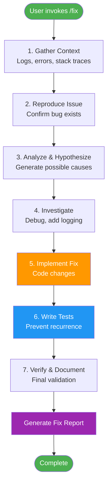

# Fix Command - Systematic Bug Resolution

> **TL;DR**: Systematically debug and fix issues using structured 7-step problem-solving approach: gather context → reproduce → analyze → investigate → implement fix → write tests → verify. Ensures root cause resolution with comprehensive testing and documentation.

## Purpose

The `/fix` command provides a **systematic, repeatable framework** for debugging and resolving software issues. Unlike ad-hoc debugging, this command ensures:

- **Root cause identification** (not just symptom treatment)
- **Test-driven verification** (bug won't recur)
- **Comprehensive documentation** (knowledge sharing)
- **Prevention strategies** (avoid similar bugs)

## When to Use

### ✅ Use `/fix` For

- Runtime errors (exceptions, crashes)
- Logic errors (incorrect behavior)
- Performance issues (slow execution, memory leaks)
- Intermittent bugs (race conditions, timing issues)
- Integration failures (API errors, database issues)
- Configuration problems (environment-specific issues)

### ❌ Don't Use `/fix` For

- Feature requests (use development workflow)
- Code refactoring (use `/review` or `/refactor`)
- Documentation updates (direct editing)
- Security vulnerabilities (use security-specific tools first)

## Usage

```bash
# Debug current error
/fix

# Fix specific issue
/fix login not working

# Fix specific error type
/fix TypeError in user service

# Fix with context
/fix "API returns 500 error when creating user with special characters"
```

## Execution Workflow



## Examples

### Example 1: Runtime Error Fix

**Scenario**: Application crashes with `TypeError: Cannot read property 'name' of undefined`

**Command**:

```bash
/fix TypeError in user service
```

**Process**:

1. Gather context: Stack trace shows error in `getUserName()` function
2. Reproduce: Call API endpoint that triggers error
3. Analyze: User object is undefined when no authentication
4. Investigate: Missing null check before accessing property
5. Fix: Add null check and return default value
6. Test: Write test for unauthenticated scenario
7. Verify: All tests pass, error resolved

**Result**: Bug fixed, test added, prevented future occurrence

### Example 2: Performance Issue Fix

**Scenario**: API endpoint responding slowly (>3s)

**Command**:

```bash
/fix slow API response in /users endpoint
```

**Process**:

1. Gather context: Profiling shows database query taking 2.8s
2. Reproduce: Load test confirms N+1 query problem
3. Analyze: Fetching related data in loop instead of join
4. Investigate: Missing eager loading on relationship
5. Fix: Add `.Include()` to load related data in single query
6. Test: Benchmark test to ensure <200ms response
7. Verify: Performance improved to 150ms average

**Result**: 95% latency reduction, benchmark test added

## What It Does

### 1. Gather Context

- Read recent error messages
- Check logs
- Review stack traces
- Identify affected files
- Check recent git changes

### 2. Reproduce the Issue

- Understand expected behavior
- Understand actual behavior
- Identify reproduction steps
- Confirm the bug exists

### 3. Analyze & Hypothesize

Generate possible causes:

- Code logic errors
- Missing error handling
- Configuration issues
- Dependency problems
- Race conditions
- Environment differences

### 4. Investigate

- Add debug logging where needed
- Check variable values
- Trace execution flow
- Verify assumptions
- Test hypotheses

### 5. Implement Fix

- Write minimal fix
- Ensure no side effects
- Add error handling
- Update related code

### 6. Write Tests

- Create failing test reproducing bug
- Verify fix makes test pass
- Add edge case tests
- Run full test suite

### 7. Verify & Document

- Test the fix thoroughly
- Check for similar issues
- Update documentation
- Create issue/PR if needed

## Debugging Strategies

### For Runtime Errors

1. Read full error message
2. Check stack trace
3. Find failing line
4. Examine variables
5. Work backwards to root cause

### For Logic Errors

1. Add logging statements
2. Verify inputs
3. Check intermediate values
4. Verify outputs
5. Compare with expected

### For Performance Issues

1. Profile the code
2. Find bottlenecks
3. Check database queries
4. Look for inefficient algorithms
5. Check for memory leaks

### For Intermittent Bugs

1. Check for race conditions
2. Look for timing issues
3. Examine shared state
4. Check external dependencies
5. Add extensive logging

## Output Format

```markdown
# Bug Fix: [Issue Description]

## Problem

[Clear description of the issue]

## Steps to Reproduce

1. [Step 1]
2. [Step 2]
3. [Step 3]

## Expected vs Actual

- **Expected**: [What should happen]
- **Actual**: [What actually happens]

## Root Cause

[Explanation of why the bug occurred]

## Solution

[How the bug was fixed]

### Changes Made

- **File**: `path/to/file.ext`
  - Line X: [Change description]
  - Line Y: [Change description]

## Tests Added

- [Test 1 description]
- [Test 2 description]

## Verification

- [x] Bug is fixed
- [x] Tests pass
- [x] No regressions
- [x] Edge cases handled

## Prevention

[How to prevent similar bugs in future]
```

## Error Handling

| Error Situation           | Symptoms                | Root Cause                    | Resolution                                         | Prevention                            |
| ------------------------- | ----------------------- | ----------------------------- | -------------------------------------------------- | ------------------------------------- |
| Cannot reproduce bug      | Fix attempt fails       | Incomplete reproduction steps | Gather more context, check environment differences | Document exact steps to reproduce     |
| Tests fail after fix      | Regression detected     | Fix introduced new bug        | Revert fix, analyze side effects                   | Run full test suite before committing |
| Fix doesn't resolve issue | Bug persists            | Wrong root cause identified   | Re-analyze, generate new hypotheses                | Verify hypothesis before implementing |
| Performance degradation   | System slower after fix | Inefficient implementation    | Profile code, optimize critical path               | Benchmark before and after            |

## Troubleshooting

### Problem: Cannot Reproduce Bug Locally

**Symptoms**: Bug reports from production but works fine locally

**Diagnosis**:

1. Check environment differences (OS, dependencies, config)
2. Review production logs for additional context
3. Verify data differences (production data vs test data)
4. Check external dependencies (APIs, databases)

**Solution**:

1. Replicate production environment locally (Docker, VMs)
2. Use production-like test data
3. Enable debug logging
4. Pair with someone who can reproduce it

### Problem: Fix Works Locally But Fails in CI/CD

**Symptoms**: Tests pass locally but fail in pipeline

**Diagnosis**:

1. Check CI environment differences
2. Review test isolation (shared state, race conditions)
3. Verify dependency versions match
4. Check timing-sensitive code

**Solution**:

1. Run tests with same conditions as CI
2. Fix flaky tests (remove timing dependencies)
3. Ensure test isolation (clean state between tests)
4. Pin dependency versions

### Problem: Multiple Root Causes Found

**Symptoms**: Several issues discovered during investigation

**Diagnosis**: Original bug is symptom of multiple underlying problems

**Solution**:

1. Create separate issues for each root cause
2. Fix critical path first
3. Add tests for each issue
4. Document dependencies between fixes

## Best Practices

1. **Always Write Tests First**: Write failing test before fixing bug (TDD approach)
2. **Commit Atomic Changes**: One bug fix per commit for clean history
3. **Document Root Cause**: Explain WHY bug occurred in commit message
4. **Add Prevention**: Update linting rules, add validation to prevent recurrence
5. **Update Documentation**: If bug was due to unclear docs, improve them
6. **Share Knowledge**: Add to team knowledge base for similar future issues

## Performance Metrics

| Metric                    | Target       | Typical    |
| ------------------------- | ------------ | ---------- |
| Time to Reproduce         | <15 min      | 10 min     |
| Time to Root Cause        | <30 min      | 25 min     |
| Time to Fix               | <60 min      | 45 min     |
| Time to Test              | <15 min      | 10 min     |
| **Total Resolution Time** | **<2 hours** | **90 min** |

## Integration

This command automatically invokes the `bug-hunter` skill for systematic debugging.

## Related Components

- **Commands**: `/test`, `/review`, `/code-review`
- **Skills**: `bug-hunter.md`, `test-generator.md`, `code-review.md`
- **Rules**: `CORE-ENGINEERING-RULES.md` (Quality gates, testing standards)
- **Tools**: Debugger (language-specific), profiler, linter

## Changelog

| Version | Date       | Author          | Changes                                                                                                                              |
| ------- | ---------- | --------------- | ------------------------------------------------------------------------------------------------------------------------------------ |
| 2.0.0   | 2026-07-03 | <AUTHOR_NAME> | Complete AI-optimized documentation with YAML frontmatter, Mermaid diagrams, comprehensive examples, error handling, troubleshooting |
| 1.0.0   | 2025-11-15 | Original        | Initial command creation                                                                                                             |
