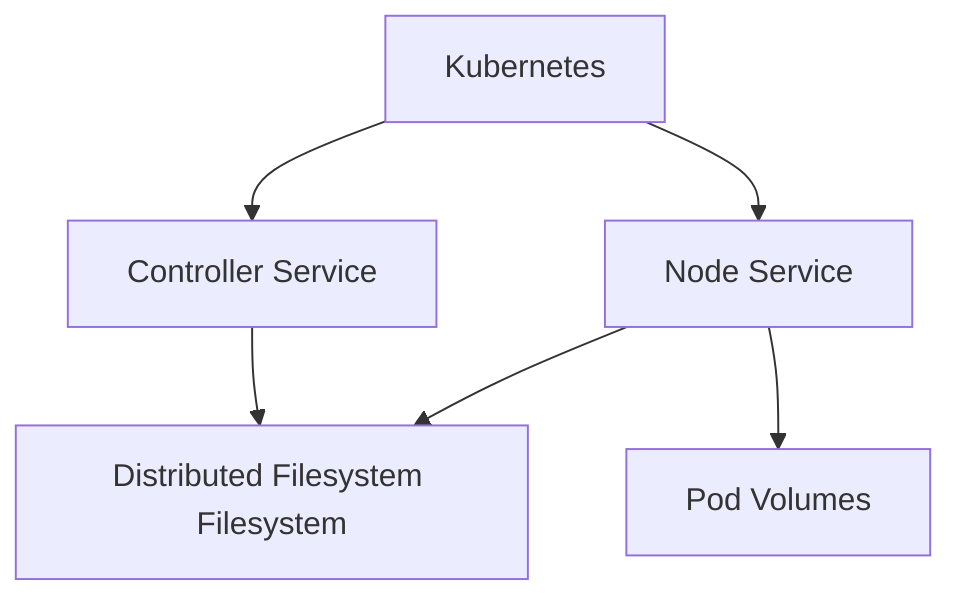

# Generate Documentation Command

**Author**: <AUTHOR_NAME>  
**Date**: 2026-04-07

Auto-generate comprehensive technical documentation from code, APIs, and system architecture.

## Usage

```bash
# Generate docs for specific file
/gendocs <file-path>

# Generate API documentation
/gendocs api <package-path>

# Generate architecture documentation
/gendocs arch <component-name>

# Generate full project documentation
/gendocs all
```

## Examples

### Generate Function Documentation
```bash
/gendocs pkg/driver/controller.go
```

**Output**: GoDoc-style documentation for all functions
```go
// CreateVolume creates a new persistent volume for the storage interface.
// It validates the request, provisions the volume on the distributed filesystem,
// and returns volume metadata.
//
// @author <AUTHOR_NAME>
//
// Parameters:
//   - ctx: Context for cancellation and timeout control
//   - req: CreateVolumeRequest containing volume name, capacity, and parameters
//
// Returns:
//   - *csi.CreateVolumeResponse: Volume metadata
//   - error: Returns error if validation or provisioning fails
```

### Generate API Documentation
```bash
/gendocs api pkg/driver
```

**Output**: API reference in Markdown
```markdown
# Storage Interface Driver API Reference

## Controller Service

### CreateVolume
**Method**: gRPC unary call  
**Request**: `CreateVolumeRequest`  
**Response**: `CreateVolumeResponse`

**Parameters**:
- `name` (string, required): Volume name
- `capacity_range` (CapacityRange): Requested size
- `volume_capabilities` ([]VolumeCapability): Access modes

**Returns**:
- `volume` (Volume): Created volume metadata
- `error`: Standard gRPC error codes
```

### Generate Architecture Documentation
```bash
/gendocs arch storage-interface
```

**Output**: Architecture overview with diagrams
```markdown
# Storage System Storage Interface Driver Architecture

## Component Diagram


## Data Flow
1. Kubernetes creates PVC
2. Controller provisions volume on Distributed Filesystem
3. Node stages volume (mount)
4. Node publishes volume to pod
5. Pod accesses storage
```

## Documentation Types

### 1. Code Documentation (GoDoc)
**Target**: Individual functions, types, packages

**Generated Sections**:
- Package overview
- Function purpose
- Parameter descriptions
- Return value descriptions
- Usage examples
- Error conditions

### 2. API Documentation
**Target**: REST APIs, gRPC services, library interfaces

**Generated Sections**:
- Endpoint/method listing
- Request/response schemas
- Authentication requirements
- Error codes
- Example requests
- Rate limits (if applicable)

### 3. Architecture Documentation
**Target**: System design, component interactions

**Generated Sections**:
- Component overview
- Interaction diagrams (Mermaid)
- Data flow descriptions
- Deployment architecture
- Scalability considerations

### 4. User Guides
**Target**: End-user documentation

**Generated Sections**:
- Getting started
- Configuration options
- Common use cases
- Troubleshooting
- FAQ

## Documentation Standards

### All Documentation Must Include
- [ ] **Author**: @author <AUTHOR_NAME>
- [ ] **Date**: Creation date
- [ ] **Purpose**: Clear statement of what the component does

### Function Documentation
- [ ] **Parameters**: All inputs with types
- [ ] **Returns**: All outputs with types
- [ ] **Errors**: Common error cases
- [ ] **Example**: At least one usage example

### API Documentation
- [ ] **Endpoint**: Full path and method
- [ ] **Authentication**: Required auth type
- [ ] **Request**: Schema and example
- [ ] **Response**: Success and error schemas
- [ ] **Example**: curl or code example

## Auto-Documentation Tools

### Go Documentation
```bash
# Generate godoc HTML
godoc -http=:6060

# View specific package
open http://localhost:6060/pkg/github.com/your-org/storage-interface-driver/pkg/driver/

# Generate static HTML
godoc -url http://localhost:6060/pkg/driver > docs/api-reference.html
```

### API Specification
```bash
# For REST APIs (if applicable)
swagger generate spec -o ./docs/api-spec.yaml

# For gRPC
protoc --doc_out=./docs --doc_opt=markdown,api.md *.proto
```

### Diagrams
```bash
# Generate architecture diagrams
# Mermaid diagrams in markdown files can be rendered via:
# - GitHub (native support)
# - Mermaid CLI: mmdc -i diagram.mmd -o diagram.png
```

## Project-Specific Examples

### ES-1048 Storage Interface Driver Documentation

**Generate controller documentation**:
```bash
/gendocs pkg/driver/controller.go
```

**Generate node service documentation**:
```bash
/gendocs pkg/driver/node.go
```

**Generate health check documentation**:
```bash
/gendocs pkg/driver/health_server.go
```

**Generate full API reference**:
```bash
/gendocs api pkg/driver
```

## Output Locations

```
docs/
├── api/
│   ├── controller-service.md   # Controller API reference
│   ├── node-service.md          # Node API reference
│   └── identity-service.md      # Identity API reference
├── architecture/
│   ├── overview.md              # High-level architecture
│   ├── volume-lifecycle.md      # Volume provisioning flow
│   └── deployment.md            # Deployment architecture
├── guides/
│   ├── installation.md          # Installation guide
│   ├── configuration.md         # Configuration reference
│   └── troubleshooting.md       # Common issues
└── reference/
    └── godoc/                   # Auto-generated godoc HTML
```

## Reference Files
- **Documentation Generator Agent**: `.ai-config/agents/documentation-generator.md`
- **Documentation Writer Agent**: `.ai-config/agents/documentation-writer.md`
- **AI Development Workflow**: `.ai-config/guides/AI_DEVELOPMENT_WORKFLOW.md`
