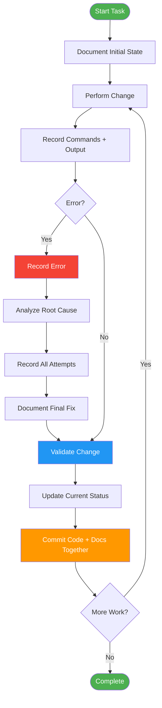
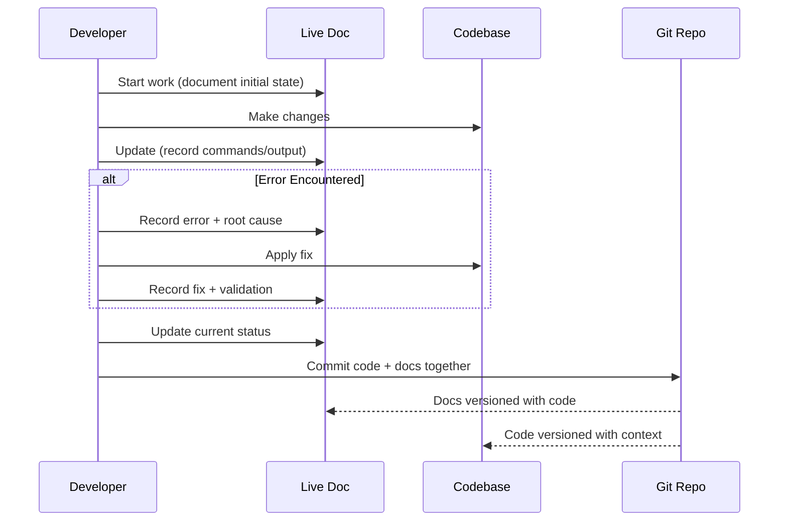

# Live Documentation Command

> **TL;DR**: Documentation updated **as work progresses**, not after completion. Every change, decision, issue, fix, test, and result recorded in real-time. Creates single source of truth. Updates happen during implementation, keeping documentation synchronized with code. Enables faster onboarding, easier debugging, better AI context, and clear audit trail.

---

## Purpose

**Live documentation** is documentation that is **continuously updated** as work progresses, rather than being written only at the end of a project.

**Problem it solves**:

- ❌ Traditional: Document after everything is complete → outdated, incomplete, forgotten details
- ✅ Live: Document during implementation → accurate, complete, fresh context

**Core principle**: Documentation IS part of implementation, not an afterthought.

---

## When to Use

### ✅ USE Live Documentation When

- Starting any multi-step technical project
- Deploying complex infrastructure (Kubernetes, storage interfaces, databases)
- Debugging issues that require multiple attempts
- Making architectural decisions that need explanation
- Working on projects where others will need to continue your work
- Building systems that AI agents will interact with
- Creating audit trails for compliance or post-mortems

### ❌ DON'T Use Live Documentation When

- One-line code fix (use commit message instead)
- Trivial changes (formatting, typos)
- Experimental throwaway code
- Quick local tests that won't be committed

---

## How It Works



---

## Document Structure

Every live documentation file MUST contain these sections:

| Section | Description | Update Frequency |
| ------- | ----------- | ---------------- |

### Example 2: Bug Fix with Multiple Attempts

**Scenario**: Fixing memory leak in storage interface

**Live Document Updates**:

````markdown
## 2026-07-03 14:30 - Memory Leak Investigation

### Issue

storage interface pods OOMKilled after 6 hours

### Initial Investigation

```bash
kubectl logs storage-system-node-xyz
# Last line: "fatal error: runtime: out of memory"
```

### Hypothesis 1: Goroutine Leak

**Test**: Added goroutine counter

```go
go func() {
    log.Printf("Goroutines: %d", runtime.NumGoroutine())
}()
```

**Result**: ❌ Goroutines stable at 50

### Hypothesis 2: Volume Handle Cache Not Released

**Test**: Checked volumeHandles map size
**Result**: ✅ FOUND! Map grows unbounded, never cleared

### Root Cause

Volume handles stored in map after volume deletion but never removed.

### Fix Applied

```go
// Added cleanup in DeleteVolume
delete(d.volumeHandles, volumeID)
```

### Validation

- Deployed patched driver
- Created/deleted 100 volumes
- Memory stable at 200MB ✅

### Current Status

✅ Memory leak fixed
✅ Tests passing
✅ PR created #1234

### Time Spent

Investigation: 2 hours
Fix: 10 minutes
Documentation: 5 minutes
````

---

## Bad vs. Good Live Documentation

### ❌ BAD: Written After Project

```markdown
# Deployment Report

Installed Kubernetes.
Installed Storage Interface Driver.
Deployment successful.
```

**Problems**:

- No commands shown
- No issues mentioned
- No decisions explained
- Can't reproduce
- No learning captured

### ✅ GOOD: Live Documentation

````markdown
## 2026-07-04 09:15 - Kubernetes Cluster Deployment

### Environment

- Ubuntu 24.04
- Kernel 6.8.0-124
- k3s v1.36.2

### Commands Executed

```bash
curl -sfL https://get.k3s.io | sh -
export KUBECONFIG=/etc/rancher/k3s/k3s.yaml
kubectl get nodes
```
````

### Issue Encountered

```
Error: connection refused
```

### Root Cause

k3s service not started automatically

### Fix

```bash
systemctl start k3s
systemctl enable k3s
```

### Validation

```bash
kubectl get nodes
# NAME          STATUS   ROLE    AGE   VERSION
# ubuntu-node   Ready    master  1m    v1.36.2
```

### Decision Made

Use k3s instead of kubeadm for simpler setup, single-node cluster sufficient for testing.

### Current Status

✅ Kubernetes running
✅ kubectl configured
❌ storage interface not yet installed

### Next Steps

1. Install KMM operator
2. Deploy Distributed Filesystem kernel modules
3. Install storage interface

````

**Benefits**:
- Exact commands to reproduce
- Issues and solutions documented
- Decisions explained with rationale
- Clear current state
- Next steps defined

---

## Live Documentation Workflow

### Step 1: Start Document

Create file: `project-name-YYYY-MM-DD.txt` (TXT FORMAT ONLY)

```
================================================================================
Project Name - Live Documentation
================================================================================

Started: 2026-07-03 09:00
Engineer: <AUTHOR_NAME>
Objective: Deploy Distributed Filesystem storage interface on Rocky Linux 9

================================================================================
ENVIRONMENT
================================================================================

Host: rocky-native
OS: Rocky Linux 9.8
Kernel: 5.14.0-687.17.1.el9_8.x86_64

================================================================================
CURRENT STATUS
================================================================================

[🔄] In Progress - Initial deployment

================================================================================
NEXT STEPS
================================================================================

1. Install KMM operator
2. Configure Distributed Filesystem modules
3. Deploy storage interface

================================================================================
```

### Step 2: APPEND During Work

After **EVERY** meaningful change, APPEND to the file:

```
2026-07-03 09:15 - Installed KMM Operator
================================================================================

COMMANDS EXECUTED:
  kubectl apply -f https://kmm.io/install.yaml

RESULT:
  [✓] All pods running

VALIDATION:
  kubectl get pods -n kmm-operator-system
  NAME                            READY   STATUS    RESTARTS   AGE
  kmm-operator-xyz                1/1     Running   0          30s

CURRENT STATUS:
  [✓] KMM operator installed
  [🔄] Distributed Filesystem modules pending

================================================================================
```

### Step 3: APPEND Issues Immediately

```
2026-07-03 09:30 - Issue: Module Build Failed
================================================================================

OBSERVED:
  Error: failed to pull image

INVESTIGATION:
  1. Checked registry credentials → [✗] Missing
  2. Created imagePullSecret → [✓] Fixed
  3. Reapplied module → [✓] Working

FIX APPLIED:
  kubectl create secret docker-registry regcred \
    --docker-server=10.136.81.185:5000 \
    --docker-username=user \
    --docker-password=pass

  kubectl patch serviceaccount default \
    -p '{"imagePullSecrets":[{"name":"regcred"}]}'

ROOT CAUSE:
  Private registry requires authentication, not configured by default.

PREVENTION:
  Add imagePullSecret creation to deployment checklist.

VALIDATION:
  kubectl get pods -n filesystem-kmm
  All pods Running [✓]

================================================================================
```

### Step 4: Commit Code + Docs Together

```bash
git add src/driver.go project-name-YYYY-MM-DD.txt
git commit -m "fix(csi): add volume handle cleanup to prevent memory leak

- Root cause: volumeHandles map never cleared after deletion
- Fix: Added delete() in DeleteVolume method
- Validation: 100 volume create/delete cycles, memory stable
- See project-name-YYYY-MM-DD.txt for investigation details"
```

**KEY RULE**: APPEND ONLY - Never create new file, never replace, always append entries chronologically to the same .txt file.

---

## Best Practices

### ✅ DO

1. **Update during implementation**, not afterward
2. **Record both successes and failures** (failures teach more)
3. **Include exact commands** (copy-paste from terminal)
4. **Capture error messages verbatim** (exact text helps debugging)
5. **Explain WHY decisions made**, not just what
6. **Timestamp every major change**
7. **Update "Current Status" after every session**
8. **Add validation results** (logs, screenshots, test output)
9. **Cross-link to code changes** (file paths, line numbers)
10. **Commit docs with code** (keep synchronized)

### ❌ DON'T

1. **Wait until end to document** (you'll forget details)
2. **Create multiple report files** (maintain one living doc)
3. **Skip failed attempts** (they contain valuable learning)
4. **Assume context is obvious** (write for someone new)
5. **Use vague language** ("fixed the issue" → show exact fix)
6. **Omit validation steps** (always prove it works)
7. **Document trivial changes** (focus on meaningful work)
8. **Copy-paste without explanation** (add context)

---

## Parameters

| Parameter            | Type    | Required | Default        | Description                                   |
| -------------------- | ------- | -------- | -------------- | --------------------------------------------- |
| `--file`             | string  | No       | Auto-generated | Path to live documentation file               |
| `--template`         | string  | No       | standard       | Template to use (standard, minimal, detailed) |
| `--format`           | string  | No       | markdown       | Output format (markdown, html)                |
| `--auto-timestamp`   | boolean | No       | true           | Automatically add timestamps to updates       |
| `--commit-with-code` | boolean | No       | true           | Commit documentation with code changes        |

---

## Error Handling

| Error Code   | Condition          | Resolution                    | Prevention                         |
| ------------ | ------------------ | ----------------------------- | ---------------------------------- |
| LIVE_DOC_001 | File not found     | Create new file with template | Always initialize at project start |
| LIVE_DOC_002 | Timestamp conflict | Append sequence number        | Use millisecond precision          |
| LIVE_DOC_003 | Malformed update   | Validate against template     | Use structured format              |
| LIVE_DOC_004 | Orphaned section   | Add missing context           | Always include "Current Status"    |

---

## Troubleshooting

### Problem 1: Documentation Getting Too Long

**Symptoms**: File exceeds 2000 lines, hard to navigate

**Solutions**:

1. Archive old sessions to separate files
2. Move resolved issues to `archive/` section
3. Keep only current status + last 2 weeks of changes
4. Create index file linking to archived docs

**Example**:

```markdown
## Archived Sessions

- [2026-07-01 to 2026-07-07](./archive/week-1.md)
- [2026-07-08 to 2026-07-14](./archive/week-2.md)

## Current Session (2026-07-15 onwards)

[Continue here...]
```

### Problem 2: Forgetting to Update

**Symptoms**: Large gaps in timeline, missing context

**Solutions**:

1. Set timer: Update every 30 minutes
2. Create Git pre-commit hook requiring doc update
3. Add documentation checklist to PR template
4. Use `/live-doc` command shortcut

**Prevention**:
Make documentation muscle memory - update BEFORE committing code.

### Problem 3: Too Much Detail

**Symptoms**: Documenting every keystroke, losing signal in noise

**Solutions**:

1. Focus on **decisions** and **issues**, not routine tasks
2. Group related commands (don't document each `ls` or `cd`)
3. Use "Investigation Steps" for attempts, "Fix Applied" for solution
4. Skip successful happy-path operations unless noteworthy

**Rule of thumb**: If you won't remember it tomorrow, document it. If it's routine, skip it.

---

## Integration with Development Workflow

### Git Workflow



### CI/CD Integration

Live documentation can be automatically validated:

```yaml
# .github/workflows/validate-docs.yml
name: Validate Live Documentation
on: [pull_request]
jobs:
  validate:
    runs-on: ubuntu-latest
    steps:
      - name: Check documentation updated
        run: |
          if [[ $(git diff --name-only origin/main | grep -E '\.md$') ]]; then
            echo "✅ Documentation updated"
          else
            echo "❌ No documentation updates found"
            exit 1
          fi
```

---

## Benefits

### For Teams

✅ **Faster Onboarding**: New engineers read live doc, understand project instantly
✅ **Easier Debugging**: Full history of issues and fixes in one place
✅ **Better Knowledge Retention**: Nothing lost when engineer leaves
✅ **Simpler Handoffs**: Complete context for next person
✅ **Clear Audit Trail**: Every decision explained and timestamped

### For AI-Assisted Development

✅ **Accurate Context**: AI has up-to-date project state
✅ **Fewer Repeated Questions**: AI reads live doc for context
✅ **More Precise Suggestions**: AI understands what was tried and failed
✅ **Better Continuity**: AI can resume work from last update
✅ **Lower Risk**: AI won't suggest outdated approaches

### ROI Calculation

**Time Investment**: ~5 minutes per significant change
**Time Saved**: 30-60 minutes per debugging session
**Break-even**: After 6-12 changes
**Long-term**: 10x faster onboarding, debugging, handoffs

---

## Related Commands

- `/fix` - Systematic debugging (pairs well with live documentation)
- `/test` - Test-driven development (record test results in live doc)
- `/review` - Code review (reference live doc for context)
- `/doc-standards` - Documentation standards guide

---

## Changelog

| Version | Date       | Changes                                                          |
| ------- | ---------- | ---------------------------------------------------------------- |
| 1.0.0   | 2026-07-03 | Initial release with complete workflow, examples, best practices |

---

**Live documentation treats documentation as part of implementation, not an afterthought. Update as you work, keep it synchronized with code, and create a permanent record of both successes and failures.**

| **Current Status** | What is working, what is not | After every change |
| **Progress Timeline** | Major milestones with timestamps | After milestones |
| **Architecture** | Diagrams, components, dependencies | When architecture changes |
| **Decisions** | Why particular approaches chosen | When decisions made |
| **Issues** | Problems encountered | When issues found |
| **Root Cause Analysis** | Why issues occurred | When root cause identified |
| **Fixes Applied** | Commands, code changes, configs | After every fix |
| **Validation** | Test results, logs, screenshots | After every validation |
| **Known Limitations** | Remaining problems | When limitations discovered |
| **Next Steps** | Pending work | After every session |
| **Change Log** | Chronological updates | After every change |

---

## Usage Examples

### Example 1: Kubernetes Storage Interface Driver Deployment

**Scenario**: Deploying Distributed Filesystem storage interface on Rocky Linux 9 with KMM

**Live Document**: `research_output/rocky9_setup/deployment-log.md`

**Updates Made**:

````markdown
## 2026-07-03 09:15 - Initial Deployment

### Environment

- Host: rocky-native (10.136.81.185)
- OS: Rocky Linux 9.8
- Kernel: 5.14.0-687.17.1.el9_8.x86_64

### Commands Executed

```bash
kubectl apply -f lnet-mod-rocky9.yaml
```

### Result

❌ Module stuck in pending state

### Issue Observed

```
kubectl get module lnet-rocky9
# Status: nodesMatchingSelectorNumber: 1
# No build pods created
```

### Root Cause

KMM v2.5.0 build trigger bug - operator accepts Module CRD but doesn't trigger build pods

### Attempts

1. ❌ Checked ConfigMap → present and correct
2. ❌ Verified node selector → matching
3. ❌ Checked KMM logs → no errors, just silence
4. ✅ Manual build workaround → SUCCESS

### Fix Applied

```bash
# Extract Dockerfile
kubectl get configmap filesystem-rocky9-dockerfile -n filesystem-kmm \
  -o jsonpath='{.data.dockerfile}' > Dockerfile

# Build manually
docker build --build-arg KERNEL_VERSION=5.14.0-687.17.1.el9_8.x86_64 \
  -t 10.136.81.185:5000/filesystem-client-rocky9:5.14.0-687.17.1.el9_8.x86_64 .

# Push to registry
docker push 10.136.81.185:5000/filesystem-client-rocky9:5.14.0-687.17.1.el9_8.x86_64
```

### Validation

```bash
kubectl get pods -n filesystem-kmm
# All pods Running ✅
```

### Decision Made

**Use manual build workaround** until KMM bug is fixed. Document in `.ai-config/rules/shubham.md` as known issue.

### Current Status

✅ Distributed Filesystem modules built and pushed
✅ storage interface pods running
❌ KMM automation broken (manual workaround in place)

### Next Steps

1. Test volume creation with storage interface
2. Document KMM bug in GitHub issue
3. Monitor for KMM v2.5.1 release
````

**Time Investment**: 2 minutes per update
**Result**: Complete project history, future debugging 10x faster
