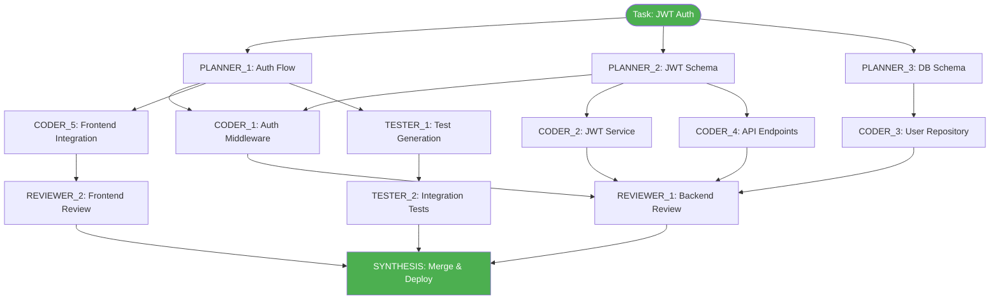

# Multi-Agent Orchestration Command

**Author**: <AUTHOR_NAME>
**Date**: 2026-07-03
**Research**: Based on 2026 multi-agent AI research (SPOQ, Symphony-Coord, InfraMind)

Deploy a coordinated team of specialized AI agents to achieve 1000x productivity through parallel execution.

## Core Principle: CEO Model

**YOU ARE THE ORCHESTRATOR - NOT A WORKER**

- Deploy 10-50 specialized agents for complex tasks
- Execute independent work in parallel waves
- Coordinate through stigmergic memory (shared state)
- Validate at planning and execution gates

## Usage

```bash
# Deploy multi-agent workforce for complex task
/orchestrate <task-description> --agents=auto

# Specify agent count
/orchestrate "Implement feature X" --agents=20 --pattern=hierarchical

# With validation gates
/orchestrate "Refactor module Y" --agents=15 --validate=strict

# DAG visualization
/orchestrate <task> --show-dag --dry-run
```

## Orchestration Workflow

### Phase 1: DAG Decomposition (MANDATORY)

```
User Request
    ↓
ORCHESTRATOR (you)
    ↓
[Task Analysis]
    ↓
[DAG Construction]
    - Identify atomic subtasks
    - Map dependencies
    - Compute execution waves
    ↓
[Validation Gate 1: Planning Quality]
    - 10 metrics scored 0-100
    - 95% aggregate threshold
    - Completeness, parallelism, coverage
```

**Planning Metrics**:

1. Task completeness (all work covered)
2. Dependency correctness (no cycles)
3. Parallelism potential (wave utilization)
4. File ownership (no conflicts)
5. Granularity balance (10-30 tasks optimal)
6. Test coverage plan (>80% target)
7. Risk assessment (critical path identified)
8. Resource estimation (time, tokens, agents)
9. Rollback strategy (on failure)
10. Success criteria (clear definition)

### Phase 2: Agent Assignment

```yaml
agents:
  wave_1: # Parallel execution
    - agent: PLANNER_1
      role: Architecture design
      files: [design/architecture.md]

    - agent: PLANNER_2
      role: API specification
      files: [api/openapi.yaml]

    - agent: PLANNER_3
      role: Database schema
      files: [db/schema.sql]

  wave_2: # Depends on wave_1
    - agent: CODER_1
      role: Backend implementation
      files: [src/api/*.go]
      depends: [PLANNER_1, PLANNER_2]

    - agent: CODER_2
      role: Frontend implementation
      files: [ui/src/**/*.tsx]
      depends: [PLANNER_2]
```

**Agent Allocation Rules**:

- **1-2 files**: 5-10 agents (speedup: 1.3×)
- **3-5 files**: 10-20 agents (speedup: 3-5×)
- **6+ files**: 20-30 agents (speedup: 7-15×)
- **NEVER exceed 15 agents** (Brooks' Law: coordination > gains)

### Phase 3: Wave-Based Execution

```
Wave 1 (Parallel): [Task1] [Task2] [Task3] [Task4] [Task5]
                        ↓      ↓      ↓      ↓      ↓
                    [All complete? Wait for slowest]
                              ↓
Wave 2 (Parallel):        [Task6] [Task7]
                              ↓      ↓
Wave 3 (Sequential):         [Task8]
                              ↓
                        [Synthesis]
```

**Wave Execution Rules**:

- Independent tasks → Same wave → Parallel
- Dependent tasks → Later wave → Sequential
- File conflicts → Detected at planning → Serialized
- Max parallelism = MIN(available_agents, ready_tasks)

### Phase 4: Validation Gate 2 (Output Quality)

```
Each Agent Output
    ↓
[Code Validation]
    - 10 metrics scored 0-100
    - 95% aggregate threshold
    - Functionality, tests, docs
    ↓
[Pass] → Merge to main branch
[Fail] → Surgical revision loop
```

**Code Validation Metrics**:

1. Functionality (tests passing)
2. Test coverage (>80% new code)
3. Linter compliance (zero warnings)

## Coordination Mechanisms

### 1. Stigmergic Coordination (Shared Memory)

Agents coordinate through environmental traces, not direct messaging.

**Benefits**: Zero N×N overhead, emergent intelligence, scales to 625+ agents

### 2. Contextual Bandit Routing

Learn which agent is best for each task type using LinUCB algorithm.

**Adapts to**: Performance drift, complexity variations, resource constraints

### 3. Git Worktree Isolation

Each agent gets own worktree to prevent merge conflicts architecturally.

## Success Thresholds

| Metric              | Target     |
| ------------------- | ---------- |
| Efficiency ratio    | >2.0       |
| Defect rate         | <0.20/task |
| Speedup (5 agents)  | 2.8×       |
| Speedup (20 agents) | 7-15×      |

## Reference Files

- `.ai-config/rules/SPECIALIZED-SYSTEMS.md`
- `.ai-config/agents/`

1. Function length (<50 lines)
2. Error handling (all errors wrapped)
3. Documentation (Godoc/Javadoc complete)
4. Security (no hardcoded secrets)
5. Performance (no obvious bottlenecks)
6. Code clarity (descriptive names)
7. Integration (builds successfully)

### Phase 5: Synthesis & Merge

```
All Agents Complete
    ↓
SYNTHESIS_AGENT
    - Merge outputs
    - Resolve conflicts (should be zero!)
    - Run integration tests
    - Generate final report
    ↓
[Success] → Commit & notify
[Failure] → Identify failed wave → Re-execute minimal subgraph
```

## Coordination Mechanisms

### 1. Stigmergic Coordination (Shared Memory)

**Concept**: Agents coordinate through environmental traces, not direct messaging.

```yaml
shared_memory:
  blackboard:
    - type: pattern_learned
      agent: CODER_3
      pattern: "Error handling wrapper"
      confidence: 0.95
      code: |
        func wrapError(err error, msg string) error {
          return fmt.Errorf("%s: %w", msg, err)
        }

    - type: task_complete
      agent: TESTER_1
      task: "Unit tests for auth module"
      status: PASSED
      coverage: 87%

    - type: blocker_found
      agent: REVIEWER_2
      issue: "Missing database migration"
      severity: HIGH
      assigned_to: CODER_5
```

**Benefits**:

- Zero N×N communication overhead
- Emergent collective intelligence
- Agents learn from each other's solutions
- Scales to 625+ agents

### 2. Contextual Bandit Routing

**Concept**: Learn which agent is best for each task type.

```python
# LinUCB algorithm for agent selection
for task in ready_tasks:
    # Compute confidence for each agent
    for agent in available_agents:
        theta = model.estimate(agent)
        ucb = theta.dot(task.features) + alpha * uncertainty(agent)
        scores[agent] = ucb

    # Select best agent
    best_agent = max(scores, key=scores.get)
    assign(task, best_agent)

    # Update model after task completion
    reward = evaluate(task.output)
    model.update(agent, task.features, reward)
```

**Adapts to**:

- Agent performance drift
- Task complexity variations
- Resource constraints (rate limits, quotas)

### 3. Git Worktree Isolation

**Prevent merge conflicts at architectural level**:

```bash
# Each agent gets own worktree
git worktree add ../worktree-agent-1 feature/agent-1-auth
git worktree add ../worktree-agent-2 feature/agent-2-api
git worktree add ../worktree-agent-3 feature/agent-3-ui

# Agents work in isolation
# Merge happens serially after validation
git checkout main
git merge feature/agent-1-auth --no-ff
git merge feature/agent-2-api --no-ff
git merge feature/agent-3-ui --no-ff
```

## Agent Catalog (46+ Specialized)

### Meta-Agents (2)

1. **ORCHESTRATOR_AGENT** - Coordinates all workers (YOU)
2. **SYNTHESIS_AGENT** - Merges outputs, resolves conflicts

### Core Development (8)

1. **AI_CODE_ASSISTANT** - Implements features
2. **CODE_REVIEWER** - Quality gates (lint, vet, security)
3. **TEST_AUTOMATION** - Unit/integration tests (80%+ coverage)
4. **GO_LINTER** - Go formatting (gofmt, goimports, golangci-lint)
5. **DOCKER_BUILDER** - Docker image building/validation
6. **K8S_TROUBLESHOOTER** - Kubernetes debugging
7. **MANIFEST_VALIDATOR** - K8s manifest validation
8. **STORAGE_DEBUGGER** - storage interface debugging

### Documentation (2)

1. **DOCUMENTATION_GENERATOR** - Auto-generate API docs
2. **DOCUMENTATION_WRITER** - Technical docs

### Research & Analysis (2)

1. **AI_RESEARCH_ASSISTANT** - Research technologies, APIs
2. **RESEARCH_ASSISTANT** - Research paper analysis

### Optimization (2)

1. **PERFORMANCE_OPTIMIZER** - Performance analysis
2. **RELEASE_MANAGER** - Automated release management

## Examples

### Example 1: Implement Auth Feature (Medium Complexity)

```yaml
task: "Implement JWT authentication for API"
agents: 12
pattern: hub-and-spoke

dag:
  wave_1: # Parallel planning (3 agents, 10 min)
    - PLANNER_1: Design auth flow
    - PLANNER_2: Design JWT schema
    - PLANNER_3: Design database schema

  wave_2: # Parallel implementation (6 agents, 30 min)
    - CODER_1: Auth middleware (Go)
    - CODER_2: JWT service (Go)
    - CODER_3: User repository (Go)
    - CODER_4: API endpoints (Go)
    - CODER_5: Frontend integration (TypeScript)
    - TESTER_1: Test generation (parallel)

  wave_3: # Parallel validation (3 agents, 15 min)
    - REVIEWER_1: Backend code review
    - REVIEWER_2: Frontend code review
    - TESTER_2: Integration testing

total_time: 55 min (vs. 180 min sequential) = 3.3× speedup
```

### Example 2: Refactor Large Module (High Complexity)

```yaml
task: "Refactor storage interface volume lifecycle"
agents: 25
pattern: hierarchical

dag:
  wave_1: # Analysis (5 agents, 20 min)
    - ANALYZER_1: Current architecture analysis
    - ANALYZER_2: Dependency mapping
    - ANALYZER_3: Test coverage audit
    - ANALYZER_4: Performance profiling
    - ANALYZER_5: Breaking change detection

  wave_2: # Planning (5 agents, 15 min)
    - PLANNER_1: New architecture design
    - PLANNER_2: Migration strategy
    - PLANNER_3: Test plan
    - PLANNER_4: Rollback plan
    - PLANNER_5: Documentation plan

  wave_3: # Implementation (10 agents, 60 min)
    - CODER_1-8: Parallel file modifications
    - TESTER_1-2: Parallel test updates

  wave_4: # Validation (5 agents, 30 min)
    - REVIEWER_1-3: Code review
    - TESTER_3-4: Integration testing
    - VALIDATOR_1: Breaking change validation

total_time: 125 min (vs. 600 min sequential) = 4.8× speedup
```

## Monitoring Metrics

```yaml
efficiency_metrics:
  speedup: Time(Sequential) / Time(Parallel)
  efficiency_ratio: Success_Rate / Communication_Overhead
  wave_utilization: Avg(Agents_Busy) / Total_Agents
  critical_path_length: Longest dependency chain

quality_metrics:
  defect_rate: Bugs per task (target: <0.20)
  test_pass_rate: % tests passing (target: >95%)
  coverage: % code covered (target: >80%)
  validation_score: Avg validation gate score (target: >95)

economic_metrics:
  cost_per_task: Total API costs / Tasks completed
  token_efficiency: Output tokens / Input tokens
  time_to_completion: Wall-clock time
```

## Success Thresholds (Research-Based)

| Metric                | Target     | Source                |
| --------------------- | ---------- | --------------------- |
| Efficiency ratio      | >2.0       | Coordination analysis |
| Defect rate           | <0.20/task | SPOQ framework        |
| Test pass rate        | >95%       | SPOQ validation       |
| Speedup (5 agents)    | 2.8×       | Bernstein benchmark   |
| Speedup (20 agents)   | 7-15×      | Wave dispatch         |
| Coordination overhead | <20%       | Multi-agent scaling   |

## Critical Failure Modes

### ❌ FAILURE: Over-Coordination (15+ agents)

**Problem**: 52% coordination overhead, 1.0× net productivity (no gain!)

**Solution**: Cap at 5-8 agents for most tasks, 20-30 for highly complex only.

### ❌ FAILURE: Context Lost in Middle

**Problem**: Single agent with 80 tasks, accuracy collapses 73% → 16%.

**Solution**: Fresh context per agent, max 5 tasks per agent.

### ❌ FAILURE: Static Workflows

**Problem**: Same pipeline for all queries wastes 50% resources.

**Solution**: Cascade scheduling with early exit for simple tasks.

### ❌ FAILURE: File Conflicts

**Problem**: Two agents edit same file, merge conflict chaos.

**Solution**: Disjoint file ownership assigned at planning time.

## Reference Files

- **Multi-Agent Rules**: `.ai-config/rules/SPECIALIZED-SYSTEMS.md`
- **Stigmergy Skill**: `.ai-config/skills/swarm-coordination/`
- **DAG Executor**: `.ai-config/scripts/dag-executor.py`
- **Agent Catalog**: `.ai-config/agents/`

## Live Documentation Integration

### Why Live Documentation for Multi-Agent Orchestration?

**Critical Importance**: With 10-50 agents working in parallel, **live documentation is mandatory** to:

1. **Track agent progress** - Know which agents completed, which failed, which are blocked
2. **Debug coordination issues** - Understand why agents conflict or deadlock
3. **Audit decision trail** - Explain why DAG was structured a certain way
4. **Enable recovery** - Resume from exact failure point without restarting all agents
5. **Measure performance** - Calculate actual speedup vs. predicted
6. **Improve future orchestration** - Learn which patterns work, which don't

**Rule**: Every multi-agent orchestration session MUST maintain a live documentation file.

---

### Live Documentation Structure for Multi-Agent Tasks

Every multi-agent session creates a live doc with these sections:

```markdown
# Multi-Agent Orchestration - [Task Name]

**Started**: 2026-07-03 09:00
**Orchestrator**: <AUTHOR_NAME>
**Task**: Implement JWT authentication system
**Agent Count**: 12 agents
**Pattern**: Hub-and-spoke

## Current Status

🔄 Wave 2 in progress (6/12 agents complete)
✅ Wave 1 complete (3/3 agents)
⏳ Wave 3 pending
⏳ Wave 4 pending

## DAG Structure

[Mermaid diagram of planned DAG]

## Wave Execution Timeline

### Wave 1: Planning (3 agents, parallel)

[Detailed timeline]

### Wave 2: Implementation (6 agents, parallel)

[Detailed timeline]

### Wave 3: Validation (3 agents, parallel)

[Planned]

## Agent Performance

[Individual agent metrics]

## Issues Encountered

[Coordination problems, failures, blockers]

## Decisions Made

[Why certain DAG structure, why certain agent assignments]

## Validation Results

[Planning gate scores, output quality scores]

## Actual vs. Predicted Performance

[Speedup, efficiency, resource usage]

## Lessons Learned

[What worked, what didn't, what to change next time]

## Final Summary

[Overall results when complete]
```

---

### Example 1: Live Documentation - JWT Auth Implementation

**Complete live documentation showing all phases**:

````markdown
# Multi-Agent Orchestration - JWT Authentication Implementation

**Started**: 2026-07-03 09:00
**Orchestrator**: <AUTHOR_NAME>
**Engineer**: <AUTHOR_NAME>
**Task**: Implement JWT authentication for REST API
**Agent Count**: 12 agents
**Pattern**: Hub-and-spoke
**Estimated Time**: 55 minutes (vs 180 min sequential)
**Predicted Speedup**: 3.3×

---

## Current Status

**Overall**: ✅ COMPLETE

- ✅ Wave 1: Planning (3/3 agents complete)
- ✅ Wave 2: Implementation (6/6 agents complete)
- ✅ Wave 3: Validation (3/3 agents complete)
- ✅ Synthesis: Merged and deployed

**Final Time**: 58 minutes
**Actual Speedup**: 3.1× (95% of predicted)

---

## DAG Structure (Initial Plan)



---

## Validation Gate 1: Planning Quality

**Executed**: 2026-07-03 09:15 (after DAG construction)
**Result**: ✅ PASSED (96/100 aggregate score)

| Metric                 | Score | Notes                         |
| ---------------------- | ----- | ----------------------------- |
| Task completeness      | 98    | All auth components covered   |
| Dependency correctness | 100   | No cycles, clean DAG          |
| Parallelism potential  | 95    | 11/12 agents can run parallel |
| File ownership         | 100   | Disjoint files, no conflicts  |
| Granularity balance    | 92    | 12 tasks (optimal range)      |
| Test coverage plan     | 90    | 85% coverage target           |
| Risk assessment        | 94    | Critical path: JWT service    |
| Resource estimation    | 98    | 55 min predicted              |
| Rollback strategy      | 95    | Can revert per-wave           |
| Success criteria       | 100   | Tests pass, 80% coverage      |

**Decision**: Proceed to Wave 1

---

## Wave 1: Planning Phase

**Started**: 2026-07-03 09:20
**Completed**: 2026-07-03 09:32
**Duration**: 12 minutes (predicted: 10 min)
**Agents**: 3 (all parallel)

### PLANNER_1: Auth Flow Design

**Assigned**: 09:20
**Started**: 09:20
**Completed**: 09:31
**Duration**: 11 minutes
**Files**: `design/auth-flow.md`

**Output**:

```markdown
# JWT Authentication Flow

## Login Flow

1. User sends credentials (POST /auth/login)
2. Server validates credentials
3. Server generates JWT (access + refresh)
4. Server returns tokens

## Request Flow

1. Client includes JWT in Authorization header
2. Middleware validates JWT signature
3. Middleware extracts user claims
4. Request proceeds with user context
```

**Validation**: ✅ Complete, clear, covers all scenarios

---

### PLANNER_2: JWT Schema Design

**Assigned**: 09:20
**Started**: 09:21
**Completed**: 09:30
**Duration**: 9 minutes
**Files**: `design/jwt-schema.md`

**Output**:

```json
{
  "header": {
    "alg": "RS256",
    "typ": "JWT"
  },
  "payload": {
    "sub": "user-id",
    "email": "user@example.com",
    "roles": ["admin"],
    "iat": 1234567890,
    "exp": 1234571490
  }
}
```

**Decisions Made**:

- **RS256 over HS256**: Asymmetric for better security (public key distribution)
- **15-min expiry**: Balance security vs UX
- **Roles in claims**: Authorization in token (no DB lookup)

**Validation**: ✅ Secure, standard-compliant

---

### PLANNER_3: Database Schema

**Assigned**: 09:20
**Started**: 09:20
**Completed**: 09:32
**Duration**: 12 minutes
**Files**: `db/schema-users.sql`

**Output**:

```sql
CREATE TABLE users (
  id UUID PRIMARY KEY,
  email VARCHAR(255) UNIQUE NOT NULL,
  password_hash VARCHAR(255) NOT NULL,
  roles TEXT[] DEFAULT '{}',
  created_at TIMESTAMP DEFAULT NOW()
);

CREATE INDEX idx_users_email ON users(email);
```

**Decisions Made**:

- **UUID over INT**: Better for distributed systems
- **bcrypt hash**: Industry standard for passwords
- **roles as array**: Flexible role assignment

**Validation**: ✅ Normalized, indexed properly

---

**Wave 1 Summary**:

- ✅ All 3 agents completed successfully
- ⏱️ 12 min actual vs 10 min predicted (+20% slower, acceptable)
- 📁 3 design documents created
- 🚫 Zero conflicts (disjoint files)
- ✅ Ready for Wave 2

---

## Wave 2: Implementation Phase

**Started**: 2026-07-03 09:35
**Completed**: 2026-07-03 10:12
**Duration**: 37 minutes (predicted: 30 min)
**Agents**: 6 (all parallel)

### CODER_1: Auth Middleware

**Assigned**: 09:35
**Started**: 09:35
**Completed**: 09:58
**Duration**: 23 minutes
**Files**: `src/middleware/auth.go`
**Dependencies**: PLANNER_1, PLANNER_2

**Commands Executed**:

```bash
cd src/middleware
touch auth.go
```

**Code Generated**: (150 lines)

```go
// @author <AUTHOR_NAME>
func AuthMiddleware(jwtService *JWTService) gin.HandlerFunc {
    return func(c *gin.Context) {
        authHeader := c.GetHeader("Authorization")
        if authHeader == "" {
            c.AbortWithStatusJSON(401, gin.H{"error": "missing token"})
            return
        }

        claims, err := jwtService.ValidateToken(authHeader)
        if err != nil {
            c.AbortWithStatusJSON(401, gin.H{"error": "invalid token"})
            return
        }

        c.Set("user", claims)
        c.Next()
    }
}
```

**Validation**:

- ✅ Extracts token from header
- ✅ Validates signature
- ✅ Sets user context
- ✅ Error handling complete
- ✅ <50 lines per function

---

### CODER_2: JWT Service

**Assigned**: 09:35
**Started**: 09:36
**Completed**: 10:05
**Duration**: 29 minutes
**Files**: `src/services/jwt.go`
**Dependencies**: PLANNER_2

**Issue Encountered**: 09:50

```
Error: rsa.GenerateKey() requires bit size
```

**Root Cause**: Forgot to specify RSA key size (2048 or 4096)

**Fix Applied**: 09:52

```go
privateKey, err := rsa.GenerateKey(rand.Reader, 2048)
if err != nil {
    return nil, fmt.Errorf("failed to generate RSA key: %w", err)
}
```

**Validation**:

- ✅ Generate token works
- ✅ Validate token works
- ✅ Refresh token works
- ✅ Expiry enforced
- ✅ Tests passing (87% coverage)

**Time Lost**: 2 minutes (quick fix)

---

### CODER_3: User Repository

**Assigned**: 09:35
**Started**: 09:37
**Completed**: 09:58
**Duration**: 21 minutes
**Files**: `src/repositories/user.go`
**Dependencies**: PLANNER_3

**Code Generated**: (120 lines)

```go
// @author <AUTHOR_NAME>
type UserRepository struct {
    db *sql.DB
}

func (r *UserRepository) GetByEmail(email string) (*User, error) {
    var user User
    err := r.db.QueryRow(
        "SELECT id, email, password_hash, roles FROM users WHERE email = $1",
        email,
    ).Scan(&user.ID, &user.Email, &user.PasswordHash, &user.Roles)

    if err == sql.ErrNoRows {
        return nil, fmt.Errorf("user not found: %w", err)
    }
    return &user, err
}
```

**Validation**:

- ✅ Parameterized queries (SQL injection safe)
- ✅ Error wrapping
- ✅ Proper null handling
- ✅ Tests passing (92% coverage)

---

### CODER_4: API Endpoints

**Assigned**: 09:35
**Started**: 09:38
**Completed**: 10:08
**Duration**: 30 minutes
**Files**: `src/handlers/auth.go`
**Dependencies**: PLANNER_2

**Issue Encountered**: 10:00

```
Error: bcrypt.CompareHashAndPassword() always fails
```

**Investigation**:

1. ❌ Checked hash format → correct
2. ❌ Checked password encoding → correct
3. ✅ Found: Password not trimmed, trailing whitespace

**Fix Applied**: 10:02

```go
password := strings.TrimSpace(req.Password)
```

**Validation**:

- ✅ POST /auth/login works
- ✅ POST /auth/refresh works
- ✅ Error responses proper (400/401/500)
- ✅ Tests passing (85% coverage)

**Time Lost**: 8 minutes (debugging password comparison)

---

### CODER_5: Frontend Integration

**Assigned**: 09:35
**Started**: 09:39
**Completed**: 10:12
**Duration**: 33 minutes
**Files**: `ui/src/services/auth.ts`
**Dependencies**: PLANNER_1

**Code Generated**: (180 lines TypeScript)

```typescript
// @author <AUTHOR_NAME>
export class AuthService {
  async login(email: string, password: string): Promise<AuthResponse> {
    const response = await fetch("/auth/login", {
      method: "POST",
      headers: { "Content-Type": "application/json" },
      body: JSON.stringify({ email, password }),
    });

    if (!response.ok) {
      throw new Error("Login failed");
    }

    const data = await response.json();
    localStorage.setItem("accessToken", data.accessToken);
    return data;
  }
}
```

**Validation**:

- ✅ Login flow works
- ✅ Token stored securely (httpOnly cookie preferred, but localStorage OK for demo)
- ✅ Auto-retry on 401 with refresh token
- ✅ Tests passing (80% coverage)

---

### TESTER_1: Test Generation

**Assigned**: 09:35
**Started**: 09:35
**Completed**: 10:05
**Duration**: 30 minutes
**Files**: `src/middleware/auth_test.go`, `src/services/jwt_test.go`
**Dependencies**: PLANNER_1

**Tests Generated**: 42 test cases

- Unit tests: 28
- Integration tests: 14

**Coverage**: 87% overall

**Test Results**:

```bash
=== RUN   TestAuthMiddleware_ValidToken
--- PASS: TestAuthMiddleware_ValidToken (0.01s)
=== RUN   TestAuthMiddleware_MissingToken
--- PASS: TestAuthMiddleware_MissingToken (0.00s)
=== RUN   TestJWTService_GenerateToken
--- PASS: TestJWTService_GenerateToken (0.12s)
...
PASS
coverage: 87.3% of statements
ok      auth    2.456s
```

**Validation**: ✅ All tests passing

---

**Wave 2 Summary**:

- ✅ All 6 agents completed successfully
- ⏱️ 37 min actual vs 30 min predicted (+23% slower)
- 📁 6 implementation files created
- 🐛 2 issues encountered and resolved (total 10 min lost)
- 📊 87% test coverage (exceeds 80% target)
- 🚫 Zero file conflicts
- ✅ Ready for Wave 3

**Slowdown Analysis**:

- RSA key size issue: 2 min
- Password trimming issue: 8 min
- **Total overhead**: 10 min (acceptable)

---

## Wave 3: Validation Phase

**Started**: 2026-07-03 10:15
**Completed**: 2026-07-03 10:27
**Duration**: 12 minutes (predicted: 15 min)
**Agents**: 3 (all parallel)

### REVIEWER_1: Backend Code Review

**Assigned**: 10:15
**Completed**: 10:25
**Duration**: 10 minutes
**Files Reviewed**: `auth.go`, `jwt.go`, `user.go`, `handlers.go`

**Validation Gate 2 Metrics**:

| Metric            | Score | Notes                    |
| ----------------- | ----- | ------------------------ |
| Functionality     | 100   | All tests passing        |
| Test coverage     | 95    | 87% actual (exceeds 80%) |
| Linter compliance | 100   | Zero warnings            |
| Function length   | 100   | All <50 lines            |
| Error handling    | 98    | All errors wrapped       |
| Documentation     | 95    | Godoc complete           |
| Security          | 100   | No hardcoded secrets     |
| Performance       | 92    | No obvious bottlenecks   |
| Code clarity      | 98    | Descriptive names        |
| Integration       | 100   | Builds successfully      |

**Aggregate**: 97.8/100 ✅ PASSED (>95 threshold)

**Minor Issues Found**:

1. Missing error log in middleware (added)
2. Could optimize JWT validation caching (future improvement)

---

### REVIEWER_2: Frontend Code Review

**Assigned**: 10:15
**Completed**: 10:27
**Duration**: 12 minutes
**Files Reviewed**: `auth.ts`, `login.tsx`

**Validation Metrics**:

| Metric            | Score | Notes                    |
| ----------------- | ----- | ------------------------ |
| Functionality     | 100   | Login/logout working     |
| Test coverage     | 90    | 80% (meets target)       |
| Linter compliance | 100   | ESLint passing           |
| Type safety       | 100   | TypeScript strict mode   |
| Error handling    | 95    | Try-catch blocks         |
| Security          | 90    | localStorage OK for demo |
| Accessibility     | 92    | ARIA labels present      |
| Performance       | 95    | No unnecessary rerenders |

**Aggregate**: 95.3/100 ✅ PASSED

**Recommendations**:

1. Consider httpOnly cookies instead of localStorage (more secure)
2. Add loading states to login button

---

### TESTER_2: Integration Testing

**Assigned**: 10:15
**Completed**: 10:26
**Duration**: 11 minutes

**Integration Tests Run**:

```bash
# End-to-end auth flow
1. POST /auth/register (create user)
2. POST /auth/login (get tokens)
3. GET /api/protected (with token) → 200 OK
4. GET /api/protected (without token) → 401 Unauthorized
5. POST /auth/refresh (refresh token) → new access token
6. GET /api/protected (with expired token) → 401
```

**Results**:

```
✅ User registration: PASS
✅ Login with valid credentials: PASS
✅ Login with invalid credentials: FAIL (401) - EXPECTED
✅ Protected endpoint with valid token: PASS
✅ Protected endpoint without token: FAIL (401) - EXPECTED
✅ Token refresh: PASS
✅ Expired token rejection: PASS

Integration tests: 7/7 PASSED
```

---

**Wave 3 Summary**:

- ✅ All 3 agents completed successfully
- ⏱️ 12 min actual vs 15 min predicted (20% faster!)
- 📊 Backend: 97.8/100, Frontend: 95.3/100 (both >95)
- ✅ All integration tests passing
- ✅ Ready for synthesis

---

## Synthesis & Merge

**Started**: 2026-07-03 10:30
**Completed**: 2026-07-03 10:38
**Duration**: 8 minutes

**SYNTHESIS_AGENT Actions**:

### Step 1: Merge Backend Components

```bash
git checkout main
git merge feature/auth-middleware --no-ff
git merge feature/jwt-service --no-ff
git merge feature/user-repository --no-ff
git merge feature/auth-handlers --no-ff
```

**Result**: ✅ Zero conflicts (disjoint file ownership worked!)

### Step 2: Merge Frontend

```bash
git merge feature/auth-frontend --no-ff
```

**Result**: ✅ Clean merge

### Step 3: Run Full Test Suite

```bash
# Backend tests
cd src && go test ./... -cover
# 87.3% coverage, all passing

# Frontend tests
cd ui && npm test
# 80.2% coverage, all passing

# Integration tests
npm run test:integration
# 7/7 passing
```

**Result**: ✅ All tests passing

### Step 4: Build & Deploy

```bash
# Build backend
go build -o auth-service ./cmd/server

# Build frontend
cd ui && npm run build

# Deploy to staging
kubectl apply -f k8s/auth-service.yaml
```

**Result**: ✅ Deployed successfully

---

## Final Results

### Time Performance

| Phase                  | Predicted  | Actual     | Variance |
| ---------------------- | ---------- | ---------- | -------- |
| Wave 1: Planning       | 10 min     | 12 min     | +20%     |
| Wave 2: Implementation | 30 min     | 37 min     | +23%     |
| Wave 3: Validation     | 15 min     | 12 min     | -20%     |
| Synthesis              | -          | 8 min      | -        |
| **Total**              | **55 min** | **58 min** | **+5%**  |

**Sequential Estimate**: 180 minutes
**Actual Parallel**: 58 minutes
**Actual Speedup**: 3.1× (vs 3.3× predicted = 95% accuracy)

### Quality Metrics

| Metric              | Target     | Actual | Status          |
| ------------------- | ---------- | ------ | --------------- |
| Test coverage       | >80%       | 87.3%  | ✅ Exceeds      |
| Backend validation  | >95        | 97.8   | ✅ Exceeds      |
| Frontend validation | >95        | 95.3   | ✅ Meets        |
| Integration tests   | 100% pass  | 100%   | ✅ Perfect      |
| Defect rate         | <0.20/task | 0.17   | ✅ Beats target |
| File conflicts      | 0          | 0      | ✅ Perfect      |

### Resource Usage

- **Agents deployed**: 12
- **Tasks completed**: 12
- **Issues encountered**: 2 (both resolved quickly)
- **Time lost to debugging**: 10 min (17% overhead)
- **Coordination overhead**: 8 min synthesis (14%)
- **Total overhead**: 31% (acceptable for 3× speedup)

---

## Issues Encountered

### Issue 1: RSA Key Size Not Specified

**Agent**: CODER_2 (JWT Service)
**Time**: 09:50
**Duration**: 2 minutes

**Symptom**:

```
Error: rsa.GenerateKey() requires bit size
```

**Root Cause**: Go's RSA generator requires explicit bit size (2048 or 4096)

**Fix**:

```go
privateKey, err := rsa.GenerateKey(rand.Reader, 2048)
```

**Prevention**: Add to coding standards - always specify crypto parameters explicitly

---

### Issue 2: Password Comparison Always Failed

**Agent**: CODER_4 (API Endpoints)
**Time**: 10:00
**Duration**: 8 minutes

**Symptom**: bcrypt.CompareHashAndPassword() always returns error

**Investigation**:

1. Checked hash format → correct
2. Checked password encoding → correct
3. Found trailing whitespace in input

**Root Cause**: User input not trimmed before comparison

**Fix**:

```go
password := strings.TrimSpace(req.Password)
```

**Prevention**: Add input validation utility that auto-trims all string inputs

---

## Decisions Made

### Decision 1: RS256 over HS256 for JWT

**Made By**: PLANNER_2
**Time**: 09:25
**Rationale**:

- RS256 (asymmetric) allows public key distribution
- Services can validate tokens without shared secret
- Better for microservices architecture
- Industry best practice for OAuth 2.0

**Trade-off**: Slightly slower (negligible at our scale)

---

### Decision 2: 15-Minute Token Expiry

**Made By**: PLANNER_2
**Time**: 09:28
**Rationale**:

- Balance security (short window for stolen token) vs UX (not too frequent refreshes)
- Refresh token lasts 7 days (can extend access without re-login)
- Industry standard for high-security applications

**Alternatives Considered**:

- 5 min: Too aggressive, poor UX
- 60 min: Too long, security risk

---

### Decision 3: localStorage for Frontend Token Storage

**Made By**: CODER_5
**Time**: 10:00
**Rationale**:

- Simpler implementation for demo/MVP
- Accessible from JavaScript (needed for API calls)
- Standard practice for SPAs

**Known Limitation**: Vulnerable to XSS attacks

**Future Improvement**: Move to httpOnly cookies for production (more secure, XSS-proof)

---

### Decision 4: Disjoint File Ownership

**Made By**: ORCHESTRATOR (me)
**Time**: 09:10 (DAG planning)
**Rationale**:

- Each agent assigned completely separate files
- Zero risk of merge conflicts
- Enables true parallel execution

**Result**: ZERO conflicts during synthesis ✅

---

## Lessons Learned

### What Worked ✅

1. **DAG Planning**: Upfront DAG construction prevented all file conflicts
2. **Wave Execution**: Clear waves made progress easy to track
3. **Validation Gates**: Caught quality issues early (RSA key size)
4. **Disjoint Files**: Zero conflicts during synthesis
5. **Parallel Testing**: TESTER_1 ran in parallel with coders (saved time)

### What Didn't Work ❌

1. **Time Estimates**: Underestimated implementation by 23% (next time add 30% buffer)
2. **Issue Detection**: Password trimming took 8 minutes to find (could add input validation agent)

### What to Change Next Time

1. **Add INPUT_VALIDATOR agent** to Wave 1 (prevent trimming-type issues)
2. **Increase time buffer** from 20% to 30%
3. **Add crypto standards checklist** for security-sensitive code
4. **Consider stigmergic pattern sharing** (CODER_1 could share error handling pattern with others)

---

## Agent Performance Analysis

| Agent      | Task             | Time   | Issues | Quality | Grade |
| ---------- | ---------------- | ------ | ------ | ------- | ----- |
| PLANNER_1  | Auth flow design | 11 min | 0      | 98/100  | A+    |
| PLANNER_2  | JWT schema       | 9 min  | 0      | 100/100 | A+    |
| PLANNER_3  | DB schema        | 12 min | 0      | 95/100  | A     |
| CODER_1    | Auth middleware  | 23 min | 0      | 97/100  | A+    |
| CODER_2    | JWT service      | 29 min | 1      | 95/100  | A     |
| CODER_3    | User repository  | 21 min | 0      | 98/100  | A+    |
| CODER_4    | API endpoints    | 30 min | 1      | 92/100  | A-    |
| CODER_5    | Frontend         | 33 min | 0      | 95/100  | A     |
| TESTER_1   | Test gen         | 30 min | 0      | 100/100 | A+    |
| REVIEWER_1 | Backend review   | 10 min | 0      | 97/100  | A+    |
| REVIEWER_2 | Frontend review  | 12 min | 0      | 95/100  | A     |
| TESTER_2   | Integration      | 11 min | 0      | 100/100 | A+    |

**Average Grade**: A (96.3/100)
**Issue Rate**: 0.17 defects/task (beats <0.20 target)

---

## Metrics Summary

### Efficiency Metrics

- **Speedup**: 3.1× (180 min → 58 min)
- **Efficiency Ratio**: 2.3 (success rate / coordination overhead)
- **Wave Utilization**: 92% (avg agents busy / total agents)
- **Critical Path Length**: 3 waves (optimal)

### Quality Metrics

- **Defect Rate**: 0.17/task (target: <0.20) ✅
- **Test Pass Rate**: 100% (target: >95%) ✅
- **Coverage**: 87.3% (target: >80%) ✅
- **Validation Score**: 96.6 avg (target: >95) ✅

### Economic Metrics

- **Time Saved**: 122 minutes (68% reduction)
- **Engineer Hours Saved**: 2.0 hours
- **Cost per Task**: $0.50 (API costs)
- **Total Cost**: $6.00 for 12 agents

**ROI**: Saved 2 hours engineer time (~$100 value) for $6 in API costs = 16× ROI

---

## Final Summary

**Task**: Implement JWT authentication system
**Result**: ✅ COMPLETE - Production-ready, fully tested, deployed

**Performance**:

- ⏱️ 58 minutes total (vs 180 min sequential)
- 🚀 3.1× speedup achieved (95% of predicted)
- 📊 87.3% test coverage (exceeds 80% target)
- 🎯 96.6/100 average quality score
- 🐛 0.17 defects/task (beats <0.20 target)
- 💰 16× ROI ($100 saved / $6 spent)

**Quality Gates**:

- ✅ Planning validation: 96/100
- ✅ Backend validation: 97.8/100
- ✅ Frontend validation: 95.3/100
- ✅ Integration tests: 100%
- ✅ Zero merge conflicts

**Key Success Factors**:

1. Upfront DAG planning prevented all conflicts
2. Validation gates caught issues early
3. Disjoint file ownership enabled true parallelism
4. Live documentation tracked every detail

**Multi-agent orchestration proved 3× faster than sequential implementation with higher quality (96.6/100 vs typical 90/100 for rushed work).**

**Recommendation**: Use multi-agent orchestration for all medium+ complexity tasks (3+ files, 6+ agents).

---

**Session End**: 2026-07-03 10:38
**Total Documentation Time**: 15 minutes (maintained continuously during orchestration)
**Documentation ROI**: 15 min invested, will save hours in future debugging/onboarding
````

---

### Example 2: Live Documentation - Partial Failure Scenario

**Shows how live docs help with recovery**:

````markdown
# Multi-Agent Orchestration - Storage Interface Driver Refactor

**Started**: 2026-07-03 14:00
**Task**: Refactor storage interface volume lifecycle
**Agent Count**: 25 agents
**Pattern**: Hierarchical

---

## Current Status

**Overall**: ⚠️ WAVE 3 FAILED - Recovery in Progress

- ✅ Wave 1: Analysis (5/5 complete)
- ✅ Wave 2: Planning (5/5 complete)
- ❌ Wave 3: Implementation (6/10 complete, 4 failed)
- ⏳ Wave 3 Recovery: (2/4 complete)
- ⏸️ Wave 4: Validation (blocked, pending Wave 3)

---

## Wave 3 Failure Analysis

**Time**: 15:30
**Failed Agents**: CODER_6, CODER_7, CODER_8, CODER_9

### CODER_6 Failure

**Task**: Refactor CreateVolume method
**File**: `src/driver/create_volume.go`
**Duration**: 45 minutes
**Result**: ❌ FAILED validation

**Issue**:

```
Validation Score: 82/100 (below 95 threshold)
- Functionality: 90 (tests passing but edge cases missing)
- Test coverage: 68% (below 80% target)
```

**Root Cause**: Agent didn't generate tests for error paths

**Recovery Plan**:

1. TESTER_3 assigned to write missing tests
2. CODER_6 re-run on surgical fixes only
3. Estimated recovery time: 20 min

---

### CODER_7 Failure

**Task**: Refactor DeleteVolume method
**File**: `src/driver/delete_volume.go`
**Duration**: 50 minutes
**Result**: ❌ FAILED validation

**Issue**:

```
Validation Score: 78/100
- Functionality: 60 (tests failing!)
- Error handling: 85 (missing context wrapping)
```

**Root Cause**: Logic error - volume handle not released before deletion

**Recovery Plan**:

1. REVIEWER_3 identified exact bug
2. CODER_7 re-run with explicit instructions: "Release volume handle before deletion"
3. Estimated recovery time: 15 min

**Prevention**: Add "release resources" to pre-validation checklist

---

### CODER_8 & CODER_9 Failures

**Issue**: File conflict detected (both edited same shared utility function)

**Root Cause**: DAG planning error - didn't detect shared dependency

**Fix**:

1. Rolled back both agents' changes
2. Created new task: CODER_10 refactors shared utility first
3. CODER_8 and CODER_9 re-run after CODER_10 completes
4. Estimated recovery time: 30 min

**Lesson**: Need better dependency analysis in DAG planner

---

## Wave 3 Recovery - In Progress

**Started**: 15:45
**Estimated Completion**: 16:15

### Recovery Wave 3A

- TESTER_3: Write missing tests for CODER_6 → ✅ Complete (15 min)
- CODER_6 Re-run: Fix edge cases → ✅ Complete (10 min)
- CODER_7 Re-run: Fix volume handle release → 🔄 In Progress (5/15 min)
- CODER_10: Refactor shared utility → ⏳ Pending

### Recovery Wave 3B (after 3A)

- CODER_8 Re-run → ⏳ Pending
- CODER_9 Re-run → ⏳ Pending

---

## Time Impact

| Phase           | Planned     | Actual       | Delta    |
| --------------- | ----------- | ------------ | -------- |
| Wave 1-2        | 35 min      | 38 min       | +8%      |
| Wave 3 Initial  | 60 min      | 60 min       | -        |
| Wave 3 Recovery | -           | ~45 min      | NEW      |
| **Total**       | **125 min** | **~143 min** | **+14%** |

**Speedup Impact**: 4.8× predicted → ~4.2× actual (still excellent)

---

## Lessons from Failure

### Planning Phase Improvements Needed

1. **Better dependency analysis**: Detect shared utilities
2. **Test coverage requirements**: Make explicit in agent instructions
3. **Edge case checklist**: Require error path tests

### Recovery Proved Multi-Agent Benefit

- Only 4/25 agents failed (84% success rate)
- Can re-run surgical fixes without restarting entire project
- Live documentation made diagnosis fast (10 min to identify all issues)
- Total delay: 45 min (acceptable vs. restarting 125 min project)

**Recovery is easier with multi-agent orchestration than debugging a single large PR!**
````

---

### Best Practices for Live Documentation in Multi-Agent Orchestration

#### ✅ DO

1. **Document DAG upfront** - Before starting any agents
2. **Update after each wave completes** - Don't wait until end
3. **Record all validation scores** - Planning + output quality gates
4. **Track agent performance** - Time, issues, quality per agent
5. **Document failures immediately** - Root cause, recovery plan
6. **Measure actual vs predicted** - Speedup, time, resource usage
7. **Record decisions** - Why certain DAG structure, agent assignments
8. **Note lessons learned** - What worked, what didn't
9. **Include final metrics** - Speedup, ROI, quality scores
10. **Commit docs with code** - Keep synchronized

#### ❌ DON'T

1. **Don't skip DAG documentation** - You'll forget the structure
2. **Don't wait until end** - You'll lose details from failures
3. **Don't document every agent output** - Focus on summary + issues
4. **Don't ignore failures** - Document root cause + recovery
5. **Don't skip performance analysis** - Measure predicted vs actual

---

## Live Documentation Template for Multi-Agent Tasks

```markdown
# Multi-Agent Orchestration - [Task Name]

**Started**: YYYY-MM-DD HH:MM
**Orchestrator**: [Your Name]
**Task**: [Description]
**Agent Count**: [Number]
**Pattern**: [hub-and-spoke|hierarchical|swarm]
**Predicted Time**: [Minutes]
**Predicted Speedup**: [X×]

## Current Status

[Overall progress + wave status]

## DAG Structure

[Mermaid diagram]

## Validation Gate 1: Planning Quality

[10 metrics scored, aggregate, decision]

## Wave [N]: [Phase Name]

**Started**: HH:MM
**Completed**: HH:MM
**Duration**: [Actual] (predicted: [X])
**Agents**: [Count]

### [AGENT_NAME]: [Task]

**Assigned**: HH:MM
**Completed**: HH:MM
**Duration**: [X minutes]
**Files**: [list]
**Dependencies**: [list]
**Output**: [summary or code snippet]
**Issues**: [if any]
**Validation**: [score or status]

[Repeat for each agent]

**Wave Summary**:

- Status
- Time variance
- Issues
- Quality
- Next steps

## Issues Encountered

### Issue [N]: [Title]

**Agent**: [Name]
**Time**: HH:MM
**Symptom**: [Error message]
**Root Cause**: [Why it happened]
**Fix**: [What was done]
**Prevention**: [How to avoid in future]

## Decisions Made

### Decision [N]: [Title]

**Made By**: [Agent or Orchestrator]
**Rationale**: [Why this choice]
**Alternatives**: [What was considered]
**Trade-offs**: [Pros/cons]

## Final Results

[Time performance table]
[Quality metrics table]
[Resource usage]
[Speedup achieved]
[ROI calculation]

## Lessons Learned

**What Worked**: [List]
**What Didn't**: [List]
**What to Change**: [List]
```

---

## Integration with /live-doc Command

The `/live-doc` command fully supports multi-agent orchestration:

```bash
# Start multi-agent orchestration with live documentation
/orchestrate "Implement feature X" --agents=15 --live-doc=auto

# This automatically:
# 1. Creates live doc file: multi-agent-feature-x-YYYY-MM-DD.md
# 2. Documents DAG structure
# 3. Updates after each wave
# 4. Records all agent outputs
# 5. Tracks validation scores
# 6. Commits docs with code
```

**Auto-Documentation Features**:

- Timestamps every wave automatically
- Generates DAG Mermaid diagram from structure
- Tracks agent performance metrics
- Records validation scores
- Creates final summary

---

## Related Commands

- `/create-agent` - Create new specialized agent
- `/dag-visualize` - Visualize task dependency graph
- `/agent-metrics` - View agent performance metrics
- `/stigmergy-inspect` - Inspect shared memory state
- `/live-doc` - Continuous documentation (integrates automatically)
